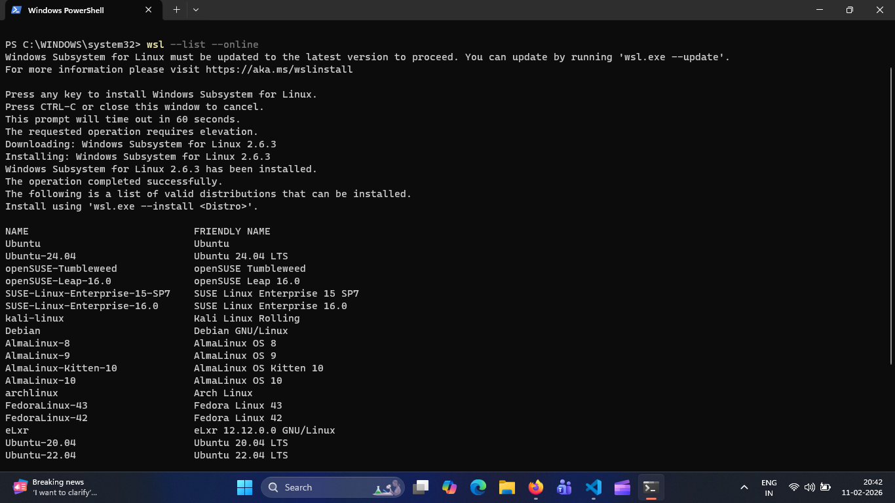
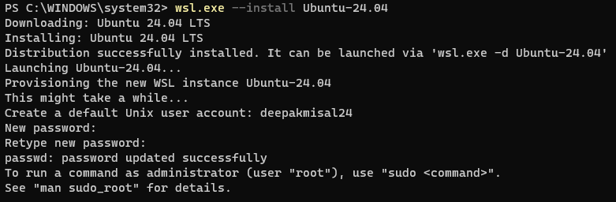

# 🚀 Installation of WSL

Following the steps below will set up the Windows Subsystem for Linux (WSL 2) on your machine, creating a professional development environment for data science.

---
### **Step 1: Enable Hardware Virtualization**
Before configuring Windows, ensure your hardware supports virtualization.
1. Access your **BIOS/UEFI** settings (usually by pressing F2, F12, or Del during startup).
2. Locate and enable **Virtualization Technology** (Intel VT-x or AMD-V).

---

### **Step 2: Enable Windows Features**
You must enable the software layers that allow WSL to run as a Type 1 hypervisor.
1. Search for **"Turn Windows features on or off"** in the Start menu.
2. Enable the following:
    - [x] **Virtual Machine Platform**
    - [x] **Windows Hypervisor Platform**
    - [x] **Windows Subsystem for Linux**
3. 🔄 **Restart your computer** to apply changes.

---

### **Step 3: Install Linux Distribution**
Open **PowerShell** or **Command Prompt** as an Administrator to fetch and install the OS.

#### **1. List available distributions**
```wsl --list --online```



#### **2. Install preferred distribution**
Using the command below, you can install a specific version. For this course, **Ubuntu 24.04** is recommended for its long-term stability.

```wsl --install -d Ubuntu-24.04```


[!IMPORTANT]
Post-Installation Setup: Once the terminal opens, you will be prompted to create a Unix Username and Password.
    - The password **will not** show characters as you type (standard Linux behavior).

    - Do not use spaces in your username.

### **Step 4: Verify Installation**

Confirm that your distribution is installed correctly and running on WSL version 2.
```wsl --list --verbose```

### **Installation of WSL is completed**

You are now ready to begin using your Linux terminal. It is recommended to run ```sudo apt update``` & ```sudo apt upgrade``` immediately to ensure your system is current.

---
### **Accessing Ubuntu via PowerShell**

Once the WSL engine is running, you can launch your environment at any time by calling the distribution name:

Syntax: wsl -d <DistributionName>
```wsl -d Ubuntu-24.04```

---

### 🛠️ Setup Instructions
You can find the step-by-step setup guide here:
👉 [WSL Setup Documentation](https://hrmiitm.github.io/tds/W0/1_wsl_setup.html)

---