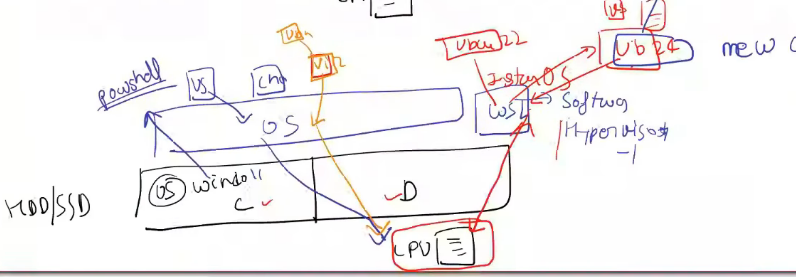

# **WSL & Ubuntu Environment Setup**
**Chapter 1 | Week 1 | Session 1**
## 🐧 WSL (Windows Subsystem for Linux)
**WSL** is a tool used to run a Linux environment directly on Windows without the overhead of a traditional virtual machine.

### Key Concepts
* **L1 Hypervisor:** WSL 2 uses a Type 1 (L1) hypervisor. Instead of running as an application on top of Windows, it runs on the same level as the Windows OS.
* **Hardware Access:** Because it sits closer to the hardware, it connects directly to the **CPU**, offering significantly better performance than Type 2 hypervisors (like VirtualBox).
* **Extensibility:** Once WSL is enabled, you can install various Linux distributions (like **Ubuntu**) on top of it.

---

### 🛠️ Setup Instructions
You can find the step-by-step setup guide here:
👉 [WSL Setup Documentation](https://hrmiitm.github.io/tds/W0/1_wsl_setup.html)

---

### 📊 Architecture Overview
The diagram below illustrates how WSL sits at the same level as the Windows OS to communicate with the hardware:




---

> [!TIP]
> After installation, remember to run `sudo apt update && sudo apt upgrade` in your Ubuntu terminal to ensure all packages are up to date.

---

## 🧠 What I Learned

### **Architectural Concepts**
* **The "What" and "Why" of WSL:** Understood WSL as a compatibility layer that allows developers to leverage Linux's powerful command-line tools and utilities directly within Windows.
* **Direct Hardware Integration:** Learned how Linux runs alongside Windows using a **Type 1 Hypervisor (WSL 2)**. Unlike traditional VMs, it shares the system's CPU and memory resources with near-native efficiency.


### **WSL vs. Virtual Machines**
| Feature | WSL 2 (Type 1 Hypervisor) | Virtual Machine (Type 2) |
| :--- | :--- | :--- |
| **Kernel** | Full Linux Kernel (Microsoft-built) | Full OS (Isolated) |
| **Performance** | Fast (Direct CPU Access) | Slower (Software Layer Lag) |
| **Integration** | Seamless (Access C: / D: drives) | Isolated (Requires Shared Folders) |
| **Resources** | Dynamic Memory Allocation | Fixed Memory Allocation |

---

## 🛠️ Practical Understanding

In this session, I successfully bridged my Windows host with a Linux environment through the following hands-on steps:

### **1. Environment Configuration**
* [x] **Feature Activation:** Enabled the *Virtual Machine Platform*, *Windows Hypervisor Platform*, and *Windows Subsystem for Linux* through Windows Features.

### **2. System Verification**
* [x] **Status Check:** Confirmed a successful installation by verifying the engine version via `wsl --version`.
* [x] **Architecture Setup:** Set the default version to **WSL 2** to ensure L1 Hypervisor performance.

### **3. Ubuntu Deployment**
* [x] **Installation:** Deployed the **Ubuntu 24.04 LTS** distribution.
* [x] **User Initialization:** Created a dedicated Linux root user and secured it with a unique password.

### **4. Terminal Operations**
* [x] **Access:** Launched the Ubuntu shell directly from the Windows Terminal.
* [x] **System Maintenance:** Performed the first crucial update of the Linux environment using:
  ```  sudo apt update && sudo apt upgrade ```
   
---

# 🛠️ Session 2: Hypervisor Deep Dive & Git Basics
**Chapter 1 | Week 1 | Session 2**

This session explores the technical "why" behind **WSL 2**, its architectural advantages over traditional Virtual Machines, and the core principles of **Version Control Systems (VCS)**.

---

## 🐙 Introduction to Version Control (Git)
The video introduces **Git** as an "Undo" button for developers that persists even after closing the editor. Unlike standard undo functions, Git allows you to track changes across weeks or months of work.

### **The Git Lifecycle**
To manage your code effectively, you follow a specific lifecycle:

* **Initialize (`git init`):** Creates a hidden `.git` folder in your directory to start tracking history.
* **Checkpoints (Commits):** These act as "save-points" in a game. If you break your code, you can "teleport" back to a previous commit (checkpoint).
---
### **Key concepts**
* **Git:** The local software installed in your WSL/Ubuntu environment that manages your history.
* **GitHub:** The cloud website (like a specialized Google Drive) where you "push" your local history for backup and collaboration.
* **Deployment:** It is the process of moving code from GitHub to a live server for user access.
* **CI/CD:** CI/CD provides the "automation" layer connecting GitHub to your final deployment.

---

## 📊 Summary of the Flow

1.  **Code:** Write code in your **WSL Ubuntu terminal** (Local).
2.  **Commit:** Save snapshots locally using **Git**.
3.  **Push:** Send the local history to **GitHub**.
4.  **Test:** **GitHub Actions (CI)** automatically runs tests.
5.  **Deploy:** **Deployment (CD)** updates your live website or API automatically.

---
