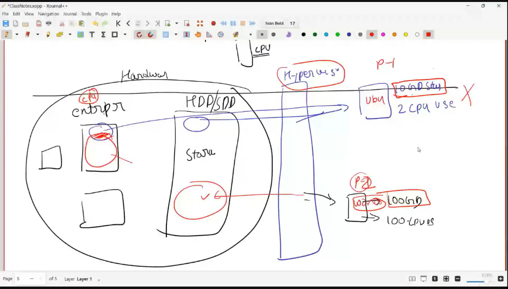

# **WSL & Ubuntu Environment Setup**
**Chapter 1 | Week 1 | Session 1**
# 🗝️ Key Concepts: WSL Installation

Here are the fundamental concepts for setting up the Windows Subsystem for Linux, summarized in single-line explanations:

* **Hardware Virtualization:** A CPU feature (Intel VT-x or AMD-V) that must be enabled in the BIOS to allow your computer to run a secondary operating system like Linux.
    
* **Virtual Machine Platform:** A Windows software layer that provides the necessary virtualization environment for WSL 2 to function.
* **Windows Hypervisor Platform:** A feature that allows third-party virtualization software to run on top of the Windows hypervisor.
* **WSL 2 (Windows Subsystem for Linux):** A compatibility layer that allows developers to run a full Linux kernel and environment directly inside Windows without a traditional virtual machine.
    
* **Linux Distribution:** A specific version of the Linux operating system (like Ubuntu 24.04) that runs on the WSL engine.
* **Unix Username & Password:** The unique administrative credentials created during the first launch to manage and secure your Linux environment.
* **Root Permissions:** The administrative level of access required to install software or update the system (invoked via `sudo`).
* **Package Manager Updates:** The essential first step of refreshing your Linux system's software database and upgrading existing files to the latest versions.
    
* **WSL Verbose Status:** A diagnostic view that confirms exactly which Linux versions are installed and whether they are currently running.
* **Cross-System Access:** The ability to launch and interact with your Linux environment directly from the Windows PowerShell or Command Prompt.

---

# 🛠️ Session 2: Hypervisor Deep Dive & Git Basics
**Chapter 1 | Week 1 | Session 2**

This session explores the technical "why" behind **WSL 2**, its architectural advantages over traditional Virtual Machines, and the core principles of **Version Control Systems (VCS)**.
### **1. Version Control Systems (VCS)**
* **Git:** A local distributed software that tracks file changes over time, allowing developers to revert to any previous state of their project.
* **The Git Lifecycle:** The process of initializing a project to track history and creating persistent save-points to manage development.
    * **Git Init:** The act of creating a hidden tracking folder to begin monitoring a project's evolution.
    * **Commits:** Logical checkpoints or snapshots that record exactly how the project looked at a specific moment in time.
* **The Three States of Git:** The conceptual workflow that manages how code moves from an active edit to a permanent record.
    
    * **Working Directory:** The space where you are currently making active, unsaved changes to your files.
    * **Staging Area (Index):** A middle-ground drafting area where you select and group specific changes before finalizing them.
    * **Local Repository:** The final database on your machine where the permanent history of all project snapshots is stored.

---

### **2. Cloud & Collaboration**
* **GitHub:** A web-based hosting service that stores your Git repositories in the cloud for backup, sharing, and team collaboration.
* **Source of Truth:** A central remote repository that acts as the master backup to protect work if a local environment fails.
* **Authentication:** The security process using cryptographic keys or tokens to verify your identity before allowing changes to a remote project.
    

---

### **3. Deployment & Live Hosting**
* **Deployment:** The technical transition of moving code from a storage repository to a live server where users can access the application.
    * **Static Hosting:** A simple hosting method for fixed files like HTML and CSS, often used for documentation or personal sites.
    * **Dynamic Hosting:** A complex hosting environment required for data science apps and APIs that need to process logic in real-time.
* **The Bridge:** The automated connection that allows hosting platforms to monitor your code and update the live app whenever changes are detected.

---

### **4. CI/CD (The Automated Pipeline)**
* **CI/CD:** An automation layer that links your code repository to the final deployment to ensure quality and speed.
    
* **Continuous Integration (CI):** An automated testing phase that checks every code update for syntax errors and build stability before it is accepted.
* **Continuous Deployment (CD):** The automated process of pushing verified code to production servers without manual intervention or downtime.

---

## 📊 Summary of the Flow

1.  **Code:** Write code in your **WSL Ubuntu terminal** (Local).
2.  **Commit:** Save snapshots locally using **Git**.
3.  **Push:** Send the local history to **GitHub**.
4.  **Test:** **GitHub Actions (CI)** automatically runs tests.
5.  **Deploy:** **Deployment (CD)** updates your live website or API automatically.

---

# 🛠️ Session 3: Hypervisors, path, UV, LLM and API keys
**Chapter 1 | Week 1 | Session 3**

This session bridges the gap between your local computer and the cloud by establishing a robust AI development environment.

---

* **Hypervisor:** A "building manager" software that lets you run multiple operating systems (like Windows and Linux) on the same physical computer simultaneously.

    
* **Absolute and Relative Path:** An **Absolute Path** is a full "mailing address" from the root (`/`), while a **Relative Path** is "local directions" based on where you are currently standing.
    
* **Ubuntu Commands:** `ls` lists files, `vi` opens a text editor, `touch` creates a new empty file, and `cd` moves you between folders.

* **Mounting (/mnt):** The process of building a "bridge" to make external drives or Windows files accessible as a folder within the Linux system.
    
* **./ (Current Dir):** A shortcut that represents exactly where you are currently located in the file system.
* **../ (Prev Dir):** A shortcut that moves you "up" or back one level to the parent folder.
* **Ubuntu /bin Folder:** A "utility closet" containing the fundamental binary programs required for the system's basic survival and commands.
    
* **UV:** An incredibly fast "delivery service" (package manager) used to install and manage Python tools and environments.
    
* **LLM (CLI tool):** A terminal-based "walkie-talkie" that lets you send prompts to AI models and get responses without a browser.
    
* **API:** A secure "digital keycard" (API Key) that proves you have permission to access and use cloud-based AI brains like Gemini.

---

# **🛠️ Chapter 4: Essential Developer Tools: Homebrew, pyenv, uv, and GitHub CLI**
**Chapter 1 | Week 1 | Session 3**

This guide covers the fundamental tools required to manage software, Python versions, and project automation directly from your terminal.

* **Homebrew:** A terminal-based "app store" for macOS and Linux that lets you install and manage developer tools with simple commands.
    
* **`uv init project_name`:** A command that instantly scaffolds a professional Python project structure, including a `README.md` and a pre-configured `.gitignore`.
    
* **`.gitignore`:** A text file that acts as a "security filter," telling Git which files (like private API keys or large environment folders) should never be uploaded to GitHub.
* **`pyproject.toml`:** The central "brain" or configuration file of a Python project that lists its metadata and all the library requirements.
    
* **`pyenv`:** A "time machine" for Python that allows you to install and switch between multiple versions of the Python engine on a single computer.
    
* **Managing Dependencies:** The process of using tools like `uv add` or `uv remove` to track and isolate the external libraries your project needs to function.

* **GitHub CLI:** A powerful tool that lets you create repositories, handle pull requests, and manage your GitHub account entirely from the command line.

---

# **🛠️ Chapter 5: Git & GitHub Ecosystem**
**Chapter 1 | Week 1 | Session 5**

## **1. Comparison: Git vs. GitHub**

| Feature | **Git** | **GitHub** |
| :--- | :--- | :--- |
| **Definition** | A local Version Control System (VCS). | A cloud-based hosting service for Git repositories. |
| **Installation** | Installed locally on your machine (CLI). | Accessible via a web browser (SaaS). |
| **Primary Purpose** | Managing history and tracking file changes. | Collaboration, backup, and project management. |
| **Internet Requirement** | Works completely offline. | Requires an internet connection to sync. |
| **Interface** | Primarily Command Line Interface (CLI). | Graphical User Interface (GUI) via web browser. |
| **Social Features** | None. | Issues, Pull Requests, Stars, and Profiles. |
| **Automation** | Via Git Hooks (local scripts). | Via GitHub Actions (cloud-based CI/CD). |

---

* **Git:** A local version control engine that tracks every change in your files, acting as a high-powered "undo" button for your code.
* **GitHub:** A cloud-based platform that hosts your Git repositories online, serving as a library for collaboration and project sharing.
* **Forking:** The process of creating a personal copy of someone else's repository on GitHub so you can experiment or contribute without affecting the original.
* **Pull Request:** A formal request sent to a project owner to review and merge your code changes from your fork into the main project.
* **Git Clone:** An operation that downloads a full copy of a remote repository, including its entire history and branches, to your local machine.
* **SSH (Secure Shell):** A secure network protocol that uses a private/public key pair to authenticate your identity with GitHub without needing a password.
* **Private Key:** A secret digital signature stored only on your computer that proves you are the authorized owner of your GitHub account.
* **Public Key:** A shared "lock" uploaded to GitHub that only your specific local private key can open during an authentication handshake.
* **Git Remote:** A bridge or connection link that tells your local Git where the online version of your project is hosted.
* **Origin:** The standard default name given to the primary remote repository you are pushing your code to on GitHub.
* **Upstream:** A reference to the original source repository from which you created your fork, used to keep your copy in sync.
* **GitHub Copilot:** An AI-powered assistant that analyzes your project's context to suggest code, write functions from comments, and generate boilerplate logic in real-time.

---
