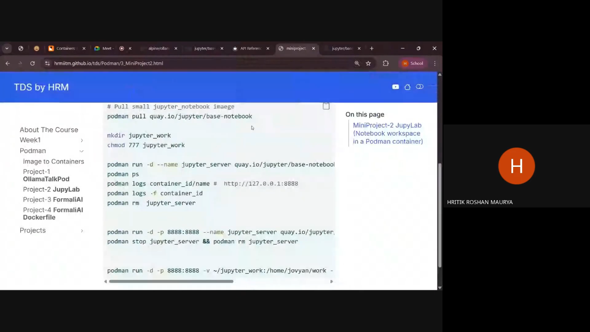

# **Docker, Podman, Ollama, Flask**
**Week 2 | Session 1**

## **Installation and Setup**
### **1. Install Podman and Dependencies**

First, update your package list and install Podman along with the QEMU emulator for x86 architecture support.
```Bash
sudo apt update
sudo apt install -y podman qemu-system-x86
podman machine init
podman machine start #Sometimes it might not work
sudo chmod 666 /dev/kvm #run this in that case. This will raise a error "/" is not shared mount then
sudo mount --make-rshared / # to overcome previous error
```

### **2. Pull the Jupyter Image**

Download the official base notebook image from the Quay.io registry.

```Bash
podman pull quay.io/jupyter/base-notebook
```

#### List images:
```bash
podman images
```
#### List running containers:
```bash
podman ps
```
#### List all containers:
```bash
podman ps -a
```


## **🛠️ Basic Container Management**
#### **Permission Handling (chmod)**
The container might not have permission to write to your local folder. So, giving full permissions to the work directory to prevent "Permission Denied" errors when saving notebooks.
```Bash
mkdir jupyter_work
# Give full read/write/execute permissions to your local work folder
chmod 777 ~/jupyter-work
```

#### Start the Container
Run the container in detached mode and map the internal port to your local machine.

```Bash
podman run -d --name jupyter_server -p 8888:8888 quay.io/jupyter/base-notebook
```

#### Accessing the Environment
1. **Check Logs:** You will need to see the logs to retrieve the login token for the first session.
``` Bash
    podman logs jupyter_server
```
2. Open Browser: Navigate to http://localhost:8888.

#### **Stopping and Cleanup**
To stop and remove the container and its associated image:
```Bash

# Stop the running container
podman stop jupyter_server

# Remove the container
podman rm jupyter_server

# Delete the image from local storage
podman rmi quay.io/jupyter/base-notebook

```

## **💾 Persistent Storage (Volume Mount)**

By default, data created inside a container is lost when the container is removed. Use the following command to map a folder on your host machine to the container, ensuring your work is saved permanently.
```Bash

podman run -d \  --name jupyter-server \  -p 8888:8888 \  -v ~/jupyter-work:/home/jovyan/work \  quay.io/jupyter/base-notebook
```



## **Ollama podman: installation and setup**

### Pull ollama images
```bash
podman pull docker.io/alpine/ollama:0.12.9
podman run -d --name ollama docker.io/alpine/ollama
```
### Install model and test
```bash
podman exec -it ollama sh #sh to invoke shell inside the container
```

### Download models in Ollama
```bash
ollama run <"Model-name:paramters"> #Ex: gemma3:270m
#Gemma 3 model is pulled and ready to use.
```

### Different commands in Ollama
```bash
ollama
```

## **Network between ollama and jupylab**
s1: Open the [site]https://ollama.readthedocs.io/en/api/
s2: Scroll to find **Request (No streaming)** then copy the **curl command**
s3: create a network
```bash
podman network create ai-network
```
s4: Run the network
```bash
podman run -d --name ollama --network ai -p 11434:11434 docker.io/alpine/ollama
```

# **Github Pages set-up**
**Week 2 | Session 2**

GitHub Pages is a static site hosting service that takes HTML, CSS, and JavaScript files directly from a repository on GitHub and publishes a website.

---

## 🛠️ Step-by-Step Setup

### 1. Create a Repository
1. Log in to your GitHub account.
2. Click the **+** icon in the top right and select **New repository**.
3. **Repository Name:** - For a *Project Site*: Use any name (e.g., `my-portfolio`).
   - For a *User Site*: Use `username.github.io` (replace `username` with your actual GitHub username).
4. Set the visibility to **Public**.
5. Check **Add a README file**.
6. Click **Create repository**.

### 2. Add Your Website Content
1. Inside your repository, click **Add file** > **Create new file**.
2. Name the file `index.html`. This **must** be in the root directory.
3. Paste the following basic HTML code:
```bash
    <!DOCTYPE html>
   <html>
   <head>
       <title>My GitHub Page</title>
   </head>
   <body>
       <h1>Successfully Deployed!</h1>
       <p>Welcome to my site hosted via GitHub Pages.</p>
   </body>
   </html>
```
4. Commit and Push these changes to the `main` branch.

### 3. Enable GitHub Pages in Settings
1. Navigate to the Settings tab of your repository.
2. On the left-hand sidebar, under the "Code and automation" section, click on **Pages**.
3. Under Build and deployment > Source, ensure "Deploy from a branch" is selected.
4.  Under Branch, select `main` (or whichever branch your code is on) and the folder (usually `/ (root)`).
5.  Click Save.

### 4: Verify the Live Site
1. Wait a minute or two for the GitHub Actions runner to finish the build.
2. At the top of the GitHub Pages settings page, you will see a banner saying: "Your site is live at..." with a URL.
3.  Click the link to view your website.

---

## **Deployment of project using Vercel**

# Step-by-Step Vercel Deployment Guide

### 1. Prepare Your Project Files
Ensure your root directory contains these three essential files:
* **`app.py`**: Your main application logic.
* **`requirements.txt`**: List of libraries (remove `uvicorn` as Vercel provides the server).
* **`vercel.json`**: Routing configuration.

### 2. Configure `vercel.json`
Create a `vercel.json` file in your root folder with the following code:

```json
{
  "version": 2,
  "builds": [
    {
      "src": "app.py",
      "use": "@vercel/python"
    }
  ],
  "routes": [
    {
      "src": "/(.*)",
      "dest": "app.py"
    }
  ]
}
```
### 3. Install & Login to Vercel CLI

Open your terminal and run:
```Bash

# Install the CLI globally
npm install -g vercel

# Authenticate your account
vercel login
```
### 4. Initialize the Project

Run the initial setup command and follow the interactive prompts:
```Bash

vercel
```
* Set up and deploy? Y

* Which scope? [Select your username]

* Link to existing project? N

* Project Name: [Give your project a name]

* In which directory? ./

* Modify settings? N

### 5. Production Deployment

Once the preview is ready, push your project to the live production environment:
```Bash

vercel --prod
```